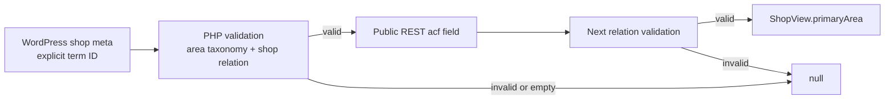

# Shop Primary Area Contract Design

**Task:** UX-AREA-PRIMARY-CONTRACT-01

**Date:** 2026-08-16

**Base:** `649d2474f6029de16b10cd4bf53f55338843cadf`
**Status:** design review

## 1. Purpose and boundary

各Shopに、明示されたPrimary Areaを0または1つ持たせる。公開Area一覧、Area SEO、将来のArea rankingが使う正式所属の土台を作るが、このtaskでは表示側を切り替えない。

既存の多対多Area relationは検索補助・legacy互換のため保持する。本番WordPress/Supabaseへの書込み、T3-A UI、SEO本文、URL、canonical、sitemap、dependencyは変更しない。

## 2. Current-state decision

- WordPressには正式なPrimary Area meta/ACFがない。
- 既存`area_slug`は`get_the_terms()`の子term優先・配列順依存なので正式値ではない。
- Supabaseの`app.shop_areas.is_primary`は将来の格納欄だが、公開正本ではなく現在値も未確定である。
- したがって、WordPress Shop post metaへ明示値を追加し、公開readerで関係整合性を再検証する。

## 3. Canonical storage contract

保存keyは`shop_primary_area_term_id`とする。

| Item | Contract |
|---|---|
| owner | WordPress `shop` post |
| storage | single post meta |
| type | positive integer term ID |
| cardinality | 0 or 1 |
| taxonomy | `area` only |
| relation | 同じShopの正式Area relationに含まれること |
| empty/0/invalid | `null`として扱う |
| inference | 禁止 |

新taxonomy、CPT、option、Supabase変更は追加しない。RESTからの新規書込み口も追加しない。将来の管理writerは、Shop IDとterm IDを同時に受ける共通validatorを通す必要がある。

## 4. Validation contract

共通validatorは`shopId`と保存候補値を受け、次をすべて満たしたときだけterm IDを返す。

1. Shop IDが正の整数である。
2. 保存値が正の整数である。小数、負数、配列、複数値は拒否する。
3. termが存在し、taxonomyが`area`である。
4. term IDがそのShopの現在のArea relationに含まれる。

どれかを満たさなければ`null`相当を返す。term順序、名前、住所、slug、親子の近さ、既存`area_slug`から補完しない。

保存時と公開時の二重防御を最終形とする。ただし、このtaskは新しいwriterを追加しないため、実装する公開readerは保存済み値を毎回検証し、不正な既存値を公開しない。

## 5. Public reader contract

WordPressは既存`rest_prepare_shop`経路を使い、検証済みの`shop_primary_area_term_id`を既存`acf` envelopeへ追加する。無効・未設定時は`null`を返す。meta自体を匿名REST書込み可能にしない。

Next readerは、受信した明示IDを埋込みArea termと照合し、次の型へ正規化する。

```ts
type ShopPrimaryAreaView = Readonly<{
  id: number;
  slug: string;
  name: string;
}>;

type ShopView = {
  // existing fields remain unchanged
  primaryArea: ShopPrimaryAreaView | null;
};
```

明示IDが欠ける、整数でない、埋込みArea relationに存在しない場合は`null`にする。既存`terms[]`とlegacy `areaSlug`は削除・意味変更しない。



## 6. Migration candidate classification

候補生成はread-onlyで全公開Shopと全Area taxonomyを取得し、機械的に次へ分類する。

### AUTO_SAFE

- 有効なArea relationがちょうど1つ、または
- relation内の末端Areaがちょうど1つで、他のrelationがすべてその末端Areaの祖先。

この場合だけ末端Areaを`proposedPrimaryArea`とする。親と子の両方が付いている例では、子が一意であり親がその祖先であることをtaxonomy ID/parent IDだけで確認する。

### NEEDS_REVIEW

- 一意に定まらない複数の末端Areaがある。
- 互いに祖先・子孫ではないAreaが複数ある。
- taxonomyの親情報が欠ける、存在しない親を指す、cycleがある。
- relation IDがArea一覧と整合しない。

`proposedPrimaryArea`は`null`とし、人間が正式根拠を確認する。

### UNCLASSIFIED

- 有効なArea relationが0件。

`proposedPrimaryArea`は`null`とする。

判定に店舗名、住所、表示名、slug文字列、検索結果、配列順、既存`area_slug`を使わない。同じ表示名でもWP IDが違えば別Shopであり、行の統合や重複除外をしない。

## 7. Candidate artifact

`docs/data/shop-primary-area-candidates-2026-08-16.json`へ次を保存する。

```json
{
  "generatedAt": "ISO-8601 timestamp",
  "source": "public WordPress REST, read-only",
  "summary": {
    "totalShops": 0,
    "autoSafe": 0,
    "needsReview": 0,
    "unclassified": 0,
    "multiArea": 0,
    "noArea": 0
  },
  "shops": [
    {
      "wpShopId": 0,
      "shopSlug": "",
      "shopName": "",
      "currentAreaRelations": [],
      "proposedPrimaryArea": null,
      "classification": "UNCLASSIFIED",
      "reason": "no-valid-area-relations"
    }
  ]
}
```

生成scriptはファイル出力以外の副作用を持たず、WordPress/Supabaseへ書き込むHTTP methodや認証値を扱わない。取得不能時は部分結果を正式成果物として保存せず失敗する。

## 8. Tests

### PHP contract

- 明示保存値だけを採用する。
- `area`以外、関係外、0、空、不正形式は`null`。
- relation順を変えても結果が変わらない。
- metaは匿名REST writerとして公開しない。

### Next reader contract

- explicit primaryだけが`primaryArea`になる。
- term順序を変えても同じ結果になる。
- 関係外ID、複数候補の自動選択、未設定は`null`。
- 同名でもWP IDが異なるShopは別entityとして正規化できる。
- 既存`terms[]`と`areaSlug`は保持する。

### Candidate classifier

- 単一relationと一意leaf+ancestorだけがAUTO_SAFE。
- 複数leaf、無関係relation、不完全階層、cycleはNEEDS_REVIEW。
- AreaなしはUNCLASSIFIED。
- 入力順や店舗文字列を変えても分類結果が変わらない。

## 9. Compatibility and rollout

- 今回は`ShopView.primaryArea`を追加するだけで、既存Area一覧やUIの絞込み条件を切り替えない。
- Primary未設定が多数でも現行表示は変わらない。
- candidate JSONは本番更新ファイルではなく、人間確認用の移行候補である。
- 本番backfillは別task、個別承認、監査記録付きで実施する。
- T3-Aは正式値が保存されたShopだけをPrimary Area所属として扱う。未設定Shopの扱いはT3-Aの別受入判断とする。

## 10. Security and failure behavior

- Secret、Application Password、cookie、認証headerを取得・表示・保存しない。
- 公開readerは関係外metaをfail closedで`null`にする。
- migration generatorはGETだけを許可し、POST/PUT/PATCH/DELETEを実装しない。
- 部分取得、ページ欠落、重複Shop ID、Area graph不整合は明示failureまたはNEEDS_REVIEWとし、AUTO_SAFEへ倒さない。
- 既存Area relationの削除、変更、再並び替えは行わない。

## 11. Acceptance criteria

- `1 Shop = 0/1 Primary Area`が明示保存値だけで成立する。
- order dependency 0、string inference 0、legacy relation破壊0。
- readerは`primaryArea` objectまたは`null`だけを返す。
- 全Shopのcandidateと分類集計が再生成可能である。
- focused test、area test、`npm test`、lint、typecheck、PHP fixture/syntax、`git diff --check`がすべてPASSする。
- 独立SPEC_COMPLIANCEとCODE_QUALITY_SECURITYでCritical/Important 0。
- 本番write、T3-A、push、deployは0。
